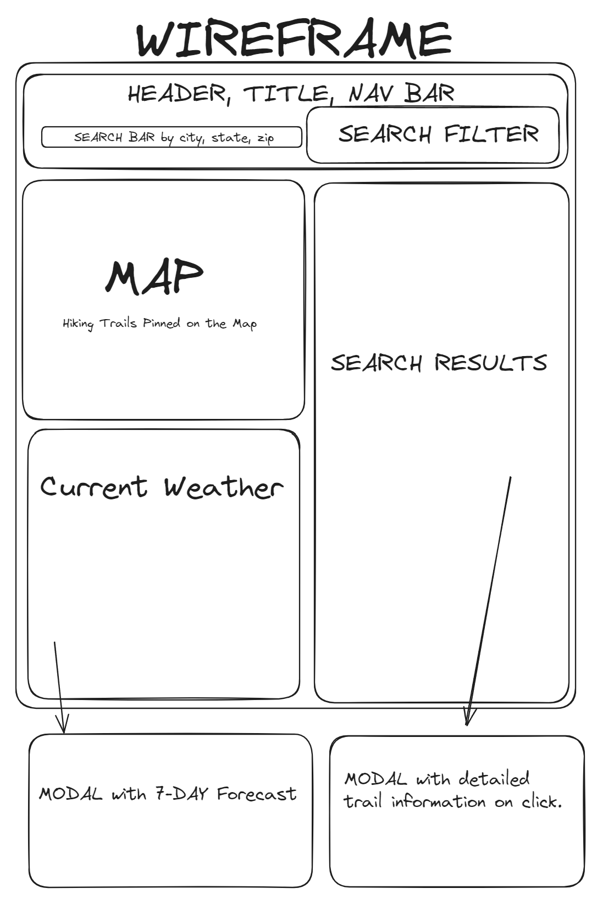

# project-1-hiking-app

# User Story:
AS A USER who is interested in hiking,

I WANT to be able to see a list of local parks with hiking trails,

SO THAT when I search by (city, zip code, state) I will see those parks populated on a Google map
//
As a USER

I WANT to be able to see weather data over 7 days

SO THAT when I search for places to hike I know when there is ideal weather
//
As a USER

I WANT TO to sort results according to several criteria {distance away, difficulty, ETA, user rating, length of trail}

SO THAT I can select the most ideal trail according to my preferences.
//
As a USER

I WANT TO be download a .gpx data file

SO THAT I can use it on my smart watch (garmin, apple, samsung, etc).

# CSS

Will be using materialize

Link: https://materializecss.com/getting-started.html

# Potential APIs

AllTrails API: AllTrails is a popular platform for finding and tracking hiking trails. They offer an API that provides access to their extensive database of trail information.

Hiking Project API: The Hiking Project API, part of the REI Co-op, offers access to a vast collection of hiking and trail data, including maps, conditions, and user-contributed content.

TrailAPI: TrailAPI is a simple RESTful API that provides access to hiking and mountain biking trail data, including trail details, photos, and user reviews.

National Park Service API: The National Park Service (NPS) provides an API that includes information about hiking trails in the various national parks across the United States.

OpenWeatherMap API: While not specific to hiking, OpenWeatherMap's API can be useful for retrieving weather data to plan your hiking trips and activities.

Leaflet and Mapbox: While not APIs, Leaflet and Mapbox are JavaScript libraries that allow you to create custom maps and integrate various location-based data, including hiking trails, into your web applications.

Google Maps API: Google Maps offers a range of APIs, including the JavaScript Maps API, which you can use to display hiking trails and outdoor locations on your website.

USGS National Map API: The United States Geological Survey (USGS) provides an API that allows access to topographic maps and elevation data, which can be useful for hiking and outdoor activities.

GPS Visualizer: GPS Visualizer is a versatile tool that allows you to convert GPS data into various formats, including GPX, KML, and more, which can be used for mapping and hiking applications.

Geocaching API: If you're interested in geocaching as a part of your hiking experience, Geocaching.com offers an API that provides geocache data and information.

# Division of labor:

Henry and Matthew: working on map api

Rob and Suraj: Working on weather api

